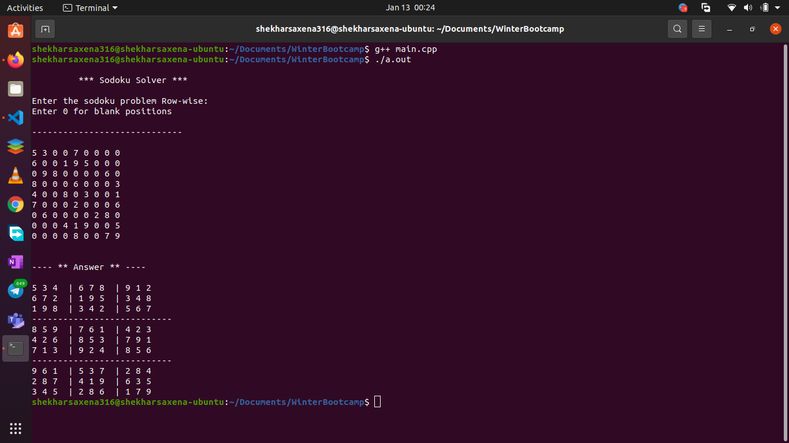

# Sodoku Solver

## Winter Programming Bootcamp : Project 02 (Week 02)

#### Aim: 

To write a C++ program to solve **Sudoku Game**

#### Introdcution:

Sudoku is a 9 x 9 number grid, and the whole grid are also divided into 3 x 3 sub-grids. We have to fill the missing places in the grid with some constraints. There are some rules to solve the Sudoku.
* Digits allowed are 1 to 9.
* One digit cannot be repeated in the same row, same column or in one 3 x 3 box.

#### Algorithm Used to Solve:

We will use a **Backtracking Algorithm**. When a placed is filled with a digit, it checks whether it is valid or not. When it is not valid, it checks for other numbers. If all numbers are checked from 1-9, and no valid digit found to place, it backtracks to previous option.

#### Checking the Validity of a Number:

To check a number is valid or not we have defined three functions:
```cpp
  bool isInCol(int col, int num);
  bool isInRow(int col, int num);
  bool isInBox(int col, int num);
```
These all three functions checks if the number is present in row, col or 3 X 3 grid respectively. If it is already present then they will return `true` otherwise `false`. Working of these functions is simple. We will itrate through the row/ col/ 2D box (in both rows and cols) and check whether the number is present or not.

```cpp
for (int i = 0; i < N; i++)
      if (grid[i][col] == num)
         return true;
   return false;
```

At last a function bool `isValid(int row, int col, int num)` checks whether the all three above functions return `false` or not. If all three return `false` then only our number is valid.

#### Finding the empty place in Sudoku Grid:

`bool findEmpty(int &row, int &col)` is defined such that it itrates through the grid and check whether `grid[row][col] == 0` or not. If it is then it will return `true` otherwise `false`

#### Solving the Sudoku - Solve():

`bool solve()` is used to solve the Sudoku. The function first checks whether the place is empty or not using `findEmpty` function. If a place is empty, then it will try numbers from 1 to 9 and checks whether any number is valid or not using `isValid` function.
* Function will return true if it finds a valid number.
* Function will return flase if no valid number is found also it places 0 at that place to unassign the place.

```cpp
bool solve(){
   int row, col;
   if (!findEmpty(row, col))
      return true; 
   for (int num = 1; num <= 9; num++){ 
      if (isValid(row, col, num)){ 
         grid[row][col] = num;
         if (solve()) 
            return true;
         grid[row][col] = 0;
      }
   }
   return false;
}
```

**In this way we can solve the Sudoku using Backtracking Algorithms.**

#### Execution of main.cpp:


